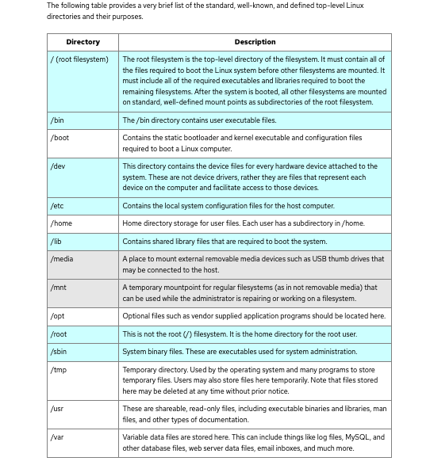

# Notes

## Linux

 | key word    | Description |
| ----------- | ----------- |
|File System||
|command Line|Use through shell software. General pattern: command option(s) arguments(s)|
Find commands     |apropos copy      |
| Find more about a command   |  man cp (every Linux has man pages installed)        |
|keyboard shotcuts|Ctrl-A &nbsp; &nbsp;(move to the begining of the line   Ctrl-E &nbsp; &nbsp; (Move to the end of the line   Ctrl-T &nbsp; &nbsp;(Transpose characters on either side of the cursor (alb->bla)   Ctrl-C &nbsp; &nbsp;(Exist a running process   Ctrl-Z &nbsp; &nbsp;(Suspend a task (use jobs to see tasks, and fg or bg to manipulate them)   Ctrl-D &nbsp; &nbsp;(End of file/end of input)   Ctrl-Shift-C &nbsp; &nbsp;(Copy selected text in a terminal)   Ctrl-Shift-X &nbsp; &nbsp;(Cut selected text in a terminal)   Ctrl-Shift-V &nbsp; &nbsp;(Paste text in a terminal)|
|Root|On every Linux system, there's a superuser account called Root.   Root is used to perform administrative tasks (installing software, changing config)  Root has the user id of Zero , the only user created during default installation   Root has unquestioned access to the system   Using root directly is not recommended   You can delagate access to its privileges to pther users with <b>sudo</b> (su-do), su and do|
|sudo| the list of users who are allowed to use super user previledges managed in the   /etc/sudoers file/   sudo cat /etc/sudoers   update with 'visudo' command   <b><u>Useful Options for sudo</u></b>   sudo -i &nbsp; &nbsp;(Run the target user's shell and switch into their home directory)   sudos -s &nbsp; &nbsp;(Run with the invoking user's shell)   sudo -l &nbsp; &nbsp;(Show what sudo privileges the user has)   sudo -u &nbsp; &nbsp;(Specifiy a user to operate as)   <b><u>While Using sudo</u></b>   <li> Logs are kept of commands that are run with <b> sudo </b>   <li> Each time <b>sudo</b> is used, a five-minute timer is reset <li>Expire the timer with <b>sudo -k</b>|
|Exploring a System||

